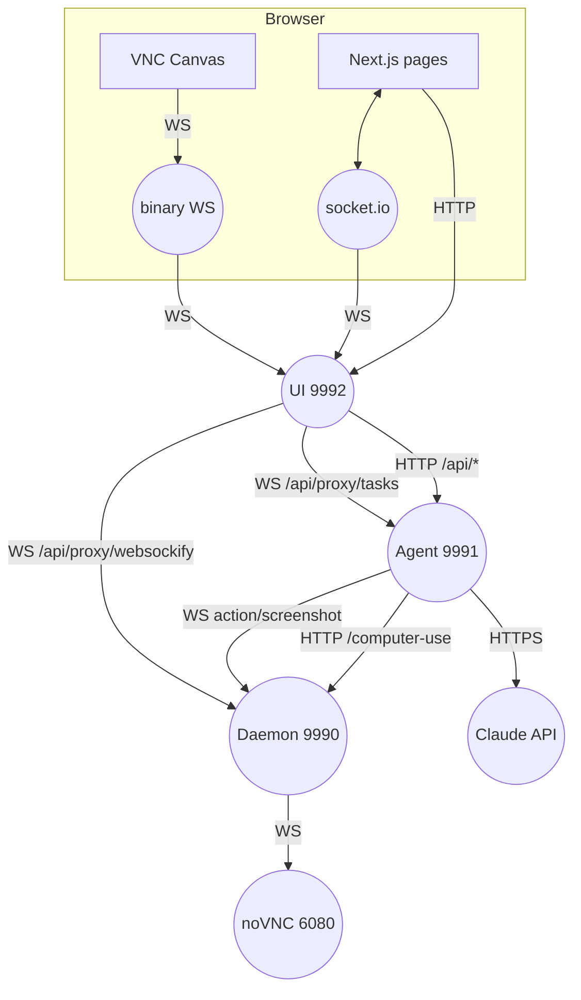
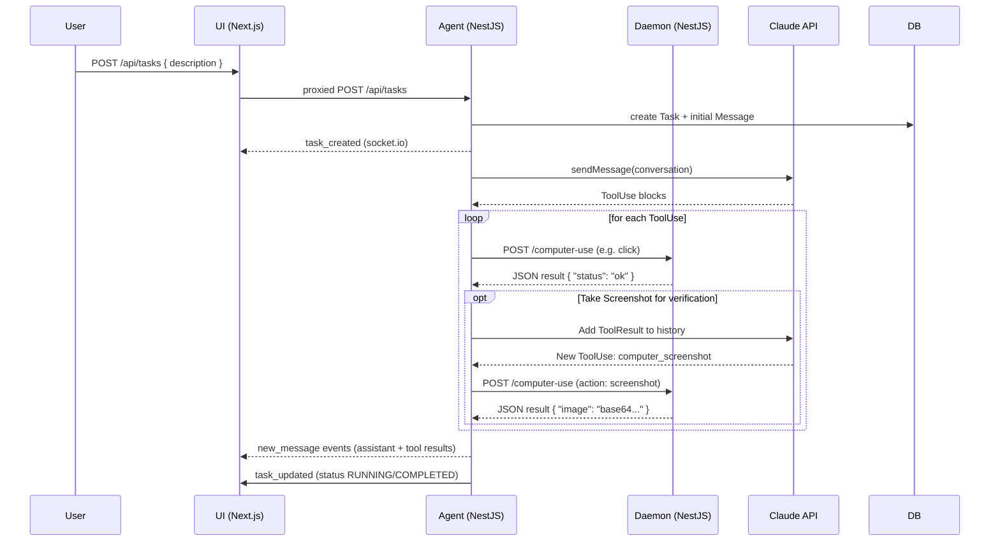

# Bytebot — Component Interface Reference

_Last updated: <!-- timestamp placeholder -->_

This file stitches together how the **UI**, **Agent**, **Desktop Daemon**, and **Shared** packages exchange data and events in a typical task lifecycle.

---
## 1. Network Topology & Ports
| Port | Container / Service | Primary Endpoints |
|------|---------------------|-------------------|
| **9992** | UI (Next.js) | `/` (pages) · `/api/*` (REST proxy) · `/api/proxy/tasks` (Socket.io WS) · `/api/proxy/websockify` (raw WS) |
| **9991** | Agent (NestJS) | `/api/tasks`, `/socket.io` |
| **9990** | Desktop Daemon (NestJS) | `/computer-use`, `/input-tracking/*`, `/socket.io`, `/websockify`, `/novnc` |
| **6080** | noVNC server (internal to Desktop) | Raw VNC protocol (proxied by Daemon) |
| — | Anthropic Cloud | HTTPS API |

All traffic between browser ↔ backends is funneled through the UI server **except** Anthropic calls (Agent direct).  The diagram below shows proxied paths.

---
## 2. Runtime Sequence (Happy Path)

---
## 3. Data Contracts
### 3.1 Shared Package
`@bytebot/shared` defines:
* `MessageContentBlock` union (Text | Image | ToolUse | ToolResult)
* `ComputerAction` union (click_mouse, type_text, …)
These types are _authoritative_ and imported in all runtime code.

### 3.2 REST API (Agent)
| Method | Path | Body / Query | Description |
|--------|------|-------------|-------------|
| POST | `/api/tasks` | `{ description, [type], [priority] }` | Create new task |
| GET | `/api/tasks/:id/messages` | `?page&limit` | Paginated message history |
| POST | `/api/tasks/:id/guide` | `{ message }` | Insert user guidance |
| POST | `/api/tasks/:id/takeover` | — | Switch control to USER & start `/input-tracking` |
| POST | `/api/tasks/:id/resume` | — | Return control to AGENT |

### 3.3 Computer Control API (Daemon)
Accepts any `ComputerAction` JSON, validated via Zod.  Returns variant-specific results or `{ image: base64 }` for screenshots.

### 3.4 WebSockets
* `Agent → UI` events (`socket.io`): `task_created`, `task_updated`, `new_message`, `task_deleted`.
* `Daemon → Agent` events:
  * `action` – bare ComputerAction
  * `screenshot` – `{ image }`
  * `screenshotAndAction` – both objects

---
## 4. Control-Transfer Protocol
1. **Agent default control** on task creation.
2. User clicks **Take Over** → UI POST `/takeover`.
3. Agent sets `control=USER`, emits update, triggers `InputCaptureService.start()` which in turn POSTs `/input-tracking/start` to Daemon.
4. Daemon streams native events & screenshots.
5. User guides with chat; Agent passes messages to LLM but _skips_ sending tool-use blocks from user.
6. **Resume** reverses the process: `/resume` → Agent updates control, stops tracking (`/input-tracking/stop`).

---
## 5. Error & Status Propagation
* Daemon errors become `ToolResult.is_error=true` blocks → stored as assistant messages → UI renders visibly.
* Task status transitions (RUNNING → COMPLETED/FAILED) are broadcast and reflected in UI status pill & VNC/screenshot switch.

---
## 6. Development Tips
1. Update `@bytebot/shared` first; run `pnpm -r dev` to rebuild dependents.
2. Use UI's `/novnc` page (`http://localhost:9992/novnc/vnc_auto.html?host=localhost&port=9992`) for low-level VNC debug.
3. You can run Daemon standalone on your host (not in container) for local desktop automation by editing `docker-compose.core.yml`.

---
## 7. Future Integration Ideas
* **gRPC / Proto** layer between Agent & Daemon to reduce JSON overhead.
* **Event Sourcing** in DB for message/action log replay.
* **Plugin System** where new MCP tools automatically surface as ComputerToolUse blocks.
* **Expose MCP/SSE Endpoint**: Formalize the existing `MCP-Nest` integration on the Daemon to allow for real-time, streaming tool invocation from external clients, as hinted at in the root README.

---

This reference should make it easy to trace any request across the stack and understand where to add features or intercept data.  Keep diagrams and tables up-to-date with future changes.