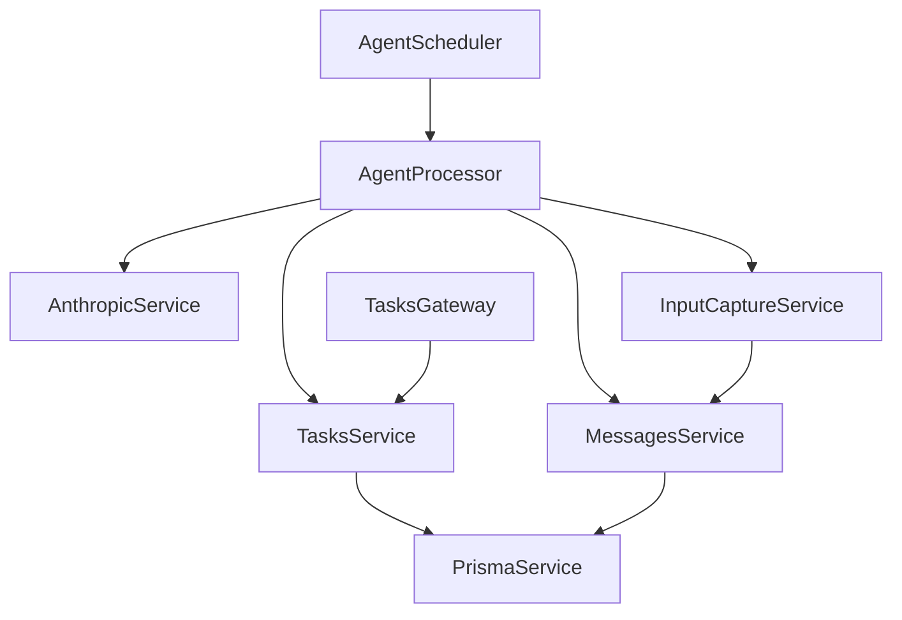

# Bytebot Agent – Package Understanding

_Last updated: <!-- timestamp placeholder -->_

The **Agent** is the central brain that converts user requests into concrete computer actions executed by the Desktop daemon. It is implemented in **NestJS** and exposes a REST + WebSocket API at port **9991** (prefixed with `/api`).

---
## 1. High-Level Responsibilities
1. Persist and manage **Tasks** & **Messages** (PostgreSQL via Prisma).
2. Interact with Anthropic Claude to turn conversation history into **ToolUse** blocks.
3. Translate ToolUse blocks into low-level computer actions or internal operations (e.g., create other tasks, change status).
4. Schedule and prioritise tasks; run one at a time via the **AgentProcessor**.
5. Stream user input (mouse/keyboard) from Desktop back into the LLM as additional ToolUse blocks (manual takeover / guidance).

---
## 2. Module Map
| Nest Module | Key Providers | Purpose |
|-------------|--------------|---------|
| **AppModule** | imports all other modules, config, schedule | Application root |
| **PrismaModule** | `PrismaService` | DB access |
| **MessagesModule** | `MessagesService` | CRUD for `Message` model |
| **TasksModule** | `TasksService`, `TasksGateway` (WebSocket) | CRUD for `Task`, push updates to UI |
| **AnthropicModule** | `AnthropicService` | Wraps Claude v2 API, converts between content-block formats |
| **AgentModule** | `AgentProcessor`, `AgentScheduler`, `InputCaptureService` | Task execution loop, cron scheduler, inbound input stream |

### Dependency Graph (simplified)

---
## 3. Key Classes & Flow
### 3.1 AgentScheduler (`agent/agent.scheduler.ts`)
• Runs every 5 s (`@Cron`) to:
  1. Promote `scheduledFor` tasks into queue (`queuedAt`)
  2. If nothing currently running, pick next task (`findNextTask`) ordered by status → priority → createdAt.
  3. Patch task status to **RUNNING** and hand off to `AgentProcessor`.

### 3.2 AgentProcessor (`agent/agent.processor.ts`)
1. Maintains internal state (`currentTaskId`, `isProcessing`).
2. Loops via `runIteration` until task status ≠ RUNNING.
3. For each iteration:
   a. Fetch full message history.
   b. Call `AnthropicService.sendMessage` → returns `MessageContentBlock[]` (Claude response).
   c. Persist assistant message.
   d. Iterate over blocks and act:
      • **ToolUse = computer_*:** delegate to helper (moveMouse, clickMouse, scroll, etc.) which issues HTTP calls to Desktop daemon (`BYTEBOT_DESKTOP_BASE_URL`).
      • **ToolUse = create_task / set_task_status:** mutate DB through `TasksService`.
   e. Persist **ToolResult** blocks so Claude has feedback.
4. Supports **task takeover / resume** via Nest event emitter to pause/continue processing and enable live `InputCaptureService`.

### 3.3 InputCaptureService (`agent/input-capture.service.ts`)
• Connects (Socket.io) to Desktop Gateway at `${BYTEBOT_DESKTOP_BASE_URL}`.
• Listens to `screenshot`, `action`, `screenshotAndAction` events.
• Transforms captured user actions into corresponding `ToolUse` blocks using helpers from **shared** package.
• Persists them as **USER** role messages, effectively inserting human guidance into the LLM loop. Note: The `AnthropicService` later filters these user-generated `ToolUse` blocks out of the payload sent to the LLM to avoid logical confusion.

### 3.4 TasksService & Gateway
• Wraps Prisma; emits WebSocket events (`taskCreated`, `taskUpdate`) to specific Socket.io "rooms" (`task_:id`) so that only relevant clients receive updates.
• Provides convenience helpers `guideTask`, `resume`, `takeOver` that update status & emit events.

---
## 4. Data Layer (Prisma)
Models: `Task`, `Message`, `Summary`, `User`, `Session`, `Account`, `Verification` plus enums `TaskStatus`, `TaskPriority`, `Role`, `TaskType`.

Important fields:
• **Task.control** – indicates whether **ASSISTANT** or **USER** currently controls execution. Toggle when user takes over.
• **Task.queuedAt/executedAt/completedAt** – life-cycle timestamps managed by scheduler/processor.
• **Summary model**: Defines a hierarchical structure for summarizing message history within a task. Its full implementation appears to be a work in progress.

---
## 5. External Interfaces
| Port | Path | Consumer | Notes |
|------|------|----------|-------|
| 9991 | `GET /api/tasks` etc. | UI / external | Task REST endpoints |
| 9991 | `ws://…/tasks` | UI WebSocket | Real-time task events |
| — | HTTP calls to `${BYTEBOT_DESKTOP_BASE_URL}/computer-use` | Agent → Desktop | Low-level actions |
| — | Socket.io client to Desktop | Desktop → Agent | Screenshots & input events |
| Anthropic API | HTTPS | Agent | `ANTHROPIC_API_KEY` required |

---
## 6. Configuration
Environment variables consumed:
* `ANTHROPIC_API_KEY`
* `BYTEBOT_DESKTOP_BASE_URL` (e.g., http://localhost:9990)
* `DATABASE_URL` (Prisma)
* `PORT` (defaults 9991)

---
## 7. Open Questions / Follow-ups
1. **Error Handling** – What retry/back-off strategy for Claude failures?
2. **Task Concurrency**: The current `AgentProcessor` is a singleton that can only execute one task at a time for a given agent instance. To support concurrent task execution, the system would need to be redesigned to spawn isolated processors per task, likely involving a move to a more robust queueing system (e.g., BullMQ, RabbitMQ) instead of the current cron-based scheduler.
3. **Security**: Auth layer is present but not enforced at the API level. A NestJS Guard should be added to the `TasksController` and `MessagesController` to validate the user's session/JWT and check for task ownership against the `Task.userId` field.
4. **Caching** – `AnthropicTools` sets cache_control=ephemeral; explore persistent tool schema caching.

---
## 8. Next Steps
→ Create similar UNDERSTANDING.md for `bytebot-ui` (frontend), then `bytebotd` (desktop daemon), and `shared` (types & utils).