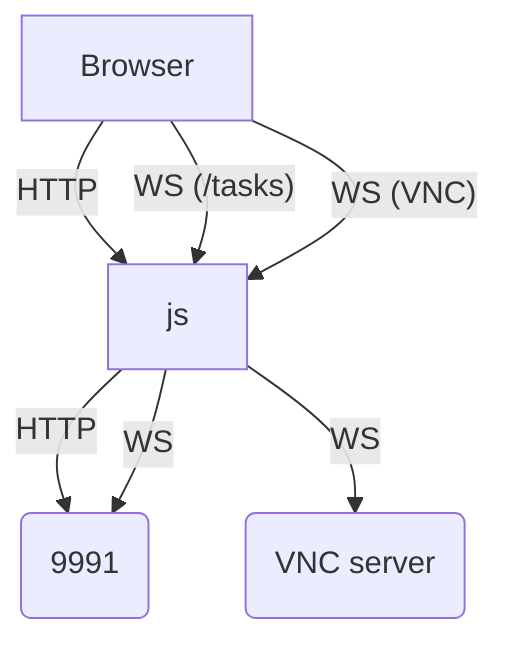

# Bytebot UI – Package Understanding

_Last updated: <!-- timestamp placeholder -->_

The **UI** package delivers a browser-based interface built with **Next.js (App Router)**. It lets users create tasks, watch the AI-controlled desktop via VNC, chat/guide the agent, and review history.

---
## 1. High-Level Responsibilities
1. **Task Management** – list tasks, show status badges, start new tasks.
2. **Chat** – render message timeline with tool-generated screenshots/images.
3. **Live Desktop View** – embed a VNC canvas (react-vnc) either view-only (agent control) or interactive (user takeover).
4. **Real-time Updates** – subscribe to WebSocket events from agent for task updates & new messages.
5. **Optional Authentication** – leverages `better-auth` library if `NEXT_PUBLIC_AUTH_ENABLED=true`.

---
## 2. Runtime Topology
| Port | Component | Purpose |
|------|-----------|---------|
| 9992 | **Custom Express server** (see `server.ts`) | Hosts Next.js; injects HTTP+WS proxies |
| — | `/api/*` (Next route) | Proxies REST to agent (`BYTEBOT_AGENT_BASE_URL`) |
| — | `/api/proxy/tasks` (WS) | Socket.io proxy to `BYTEBOT_AGENT_BASE_URL/socket.io` |
| — | `/api/proxy/websockify` (WS) | Raw WS proxy to Desktop VNC (`BYTEBOT_DESKTOP_VNC_URL`) |

Flow diagram:


---
## 3. Key Files / Modules
| Path | Purpose |
|------|---------|
| `server.ts` | Custom Express wrapper; handles all WebSocket proxying (Socket.io, VNC) and serves the Next.js app. |
| `next.config.ts` | Adds `@bytebot/shared` to transpilePackages. |
| `src/app/api/[[...path]]/route.ts` | Generic **HTTP-only** edge route that forwards REST calls to the agent, preserving cookies. |
| `src/hooks/useWebSocket.ts` | Wraps `socket.io-client`; automatic reconnection; exposes `joinTask`, `leaveTask`. |
| `src/hooks/useChatSession.ts` | Complex state machine that ties together REST fetches, websocket events, pagination, guiding/takeover flow. |
| `src/components/vnc/VncViewer.tsx` | Loads `react-vnc` dynamically, constructs WS url `/api/proxy/websockify`. Handles viewOnly vs interactive mode. |
| `src/components/screenshot/ScreenshotViewer.tsx` | Displays the active screenshot for non-running tasks, synced with chat scroll. |
| `src/components/messages/*` | Chat renderers (text, image, tool result). |
| `src/utils/taskUtils.ts` | Thin wrappers for REST endpoints (`/api/tasks`, `/guide`, etc.). |
| `src/lib/auth.ts` + `components/providers/auth-provider.tsx` | Optional Better-Auth integration; disabled by default unless env flag. |

---
## 4. React Page Map (App Router)
```text
/app
│ layout.tsx      -> wraps pages with global styles & AuthProvider
│ page.tsx        -> Home; task creation form + sample prompts + recent tasks
│ /login/page.tsx -> Simple login (if Auth enabled)
│ /desktop/page.tsx (reserved)  
│ /tasks
│   └ page.tsx         -> All tasks list
│   └ [id]/page.tsx    -> Task detail (chat + VNC/screenshot)
└ /api/[[...path]]     -> REST proxy route
```

---
## 5. State & Data Flow
1. **Create Task** (Home page): `startTask()` POSTs to `/api/tasks` (proxied to agent) → returns ID → router push to `/tasks/:id`.
2. **Task Page** loads initial task & last 10 messages via REST, then:
   • Opens socket.io connection, `joinTask(id)`
   • Receives `task_updated`, `new_message` events; appends to state.
   • If user clicks "Take Over", POST `/api/tasks/:id/takeover` and sets interactive VNC.
3. **Guide Mode**: When user types in ChatInput while task RUNNING, `guideTask()` POSTs message; UI marks it as user message immediately.
4. **Screenshot Scroll** (`useScrollScreenshot`): For completed tasks, walks message history to extract screenshots, syncs with scroll.

---
## 6. Environment Variables
* `BYTEBOT_AGENT_BASE_URL` – e.g., http://localhost:9991
* `BYTEBOT_DESKTOP_VNC_URL` – e.g., http://localhost:9993/websockify
* `PORT` – UI server port (defaults 9992)
* `NEXT_PUBLIC_BYTEBOT_AGENT_BASE_URL` – public variant for Better-Auth client
* `NEXT_PUBLIC_AUTH_ENABLED` – "true" to enable auth

---
## 7. Open Questions / Improvements
1. **CSR vs SSR** – Majority of pages marked "use client"; potential SEO/First-load optimisations.
2. **State Duplication** – Several hook states might be moved to global store (Zustand/Redux) to avoid prop drilling.
3. **Error Handling & Toasts** – Currently console.error; add user-visible notifications.
4. **Permission / RBAC** – When auth enabled, backend still needs to enforce user ownership on tasks/messages.
5. **Accessibility** – Verify Chat/VNC controls have proper labels & keyboard shortcuts.

---
## 8. Next Steps
• Analyse **bytebotd** (desktop daemon) to chart REST & Socket endpoints it exposes.<br/>
• Document **shared** package to catalogue common types & util functions. 