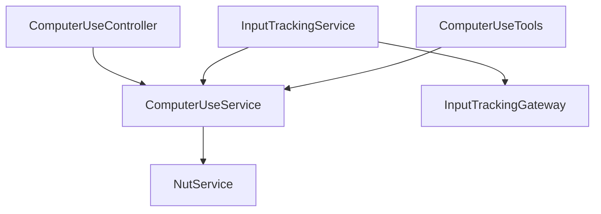

# Bytebot Desktop Daemon (bytebotd) – Package Understanding

_Last updated: <!-- timestamp placeholder -->_

The **Desktop Daemon** runs **inside the Ubuntu+XFCE container** to provide a programmatic interface for low-level OS automation and screen streaming.  It is a NestJS service listening on port **9990**.

---
## 1. High-Level Responsibilities
1. **Computer Control API** – POST `/computer-use` endpoint that executes mouse/keyboard actions, scrolling, screenshots, etc.
2. **Input Tracking** – Monitors local user input via native hooks (uiohook-napi) and emits action events + screenshots to connected Socket.io clients.
3. **VNC Proxy** – Re-exposes the container's `websockify` (noVNC) endpoint on `/websockify` so the UI can tunnel the live desktop feed.
4. **MCP / Tool Registration** – Wraps the Computer API into MCP tools (`@rekog/mcp-nest`) for SSE-based remote procedure calls.
5. **NutJS Abstraction** – Uses `@nut-tree-fork/nut-js` to perform cross-platform mouse & keyboard events and capture screen dumps.

---
## 2. Module Overview
| Nest Module | Key Providers | Purpose |
|-------------|--------------|---------|
| **NutModule** | `NutService` | Thin wrapper around nut-js; converts X11 keysyms, takes screenshots, etc. |
| **ComputerUseModule** | `ComputerUseService`, `ComputerUseController` | REST endpoint `/computer-use` validating `ComputerActionDto` -> Nut actions |
| **InputTrackingModule** | `InputTrackingService`, `InputTrackingGateway` (Socket.io), `InputTrackingController` | Starts/stops global input hooks; debounces and emits events to clients |
| **BytebotMcpModule** | `ComputerUseTools` | Registers the same actions as MCP tools with JSON-schema (zod) contracts |
| **ServeStaticModule** | Serves noVNC static files at `/novnc` (root `/opt/noVNC`) |

Dependency graph (simplified):


---
## 3. Runtime Ports & Paths
| Port | Path | Protocol | Purpose |
|------|------|----------|---------|
| 9990 | `/computer-use` | HTTP POST | Execute action JSON body |
| 9990 | `/input-tracking/start|stop` | HTTP POST | Begin/end native hook capture |
| 9990 | `/socket.io` | WS | Broadcast `action`, `screenshot`, `screenshotAndAction` events |
| 9990 | `/websockify` | WS (binary) | Proxy to internal noVNC server (`localhost:6080`) |
| 9990 | `/novnc` | HTTP static | noVNC web client assets |

---
## 4. Computer Actions Schema
Action DTO supports 12 variants (union) such as `move_mouse`, `click_mouse`, `drag_mouse`, `scroll`, `type_keys`, `type_text`, `wait`, `screenshot`, `cursor_position`.
Validation is enforced by `ComputerActionValidationPipe` using `zod` schemas.

Example request:
```json
POST /computer-use
{
  "action": "click_mouse",
  "coordinates": { "x": 500, "y": 400 },
  "button": "left",
  "numClicks": 1
}
```

---
## 5. Input Tracking Flow
1. Agent (or UI) calls `/input-tracking/start` when a human takes over.
2. `InputTrackingService` registers uIOhook listeners for mouse, keyboard, wheel events.
3. Events are aggregated / debounced into high-level actions matching the ComputerAction schema.
4. For click & trace actions, a fresh screenshot (`ComputerUseService.screenshot()`) is captured (PNG base64) via NutJS.
5. Gateway emits either:
   • `action` — single action (e.g., key press)
   • `screenshotAndAction` — when mouse click/drag plus screenshot
   • `screenshot` — when only a periodic screen capture desired
6. Agent's `InputCaptureService` ingests these and stores as `ToolUse` blocks.

---
## 6. MCP Tool Exposure
`ComputerUseTools` defines 12 tools mirroring the REST actions. Each method:
* Validates/serialises params via `zod`
* Delegates to `computerUse.action()`
* Returns Claude-compatible `content` array (text or compressed PNG)
A small `compressPngBase64Under1MB` util downscales screenshots to fit tool result size limits.

---
## 7. Environment Variables & Config
* No mandatory env vars; optional config loaded via `ConfigModule`.
* VNC internal server expected at `http://localhost:6080`; proxy path `/websockify` defined in `main.ts`.

---
## 8. Open Questions / Future Work
1. **Security** – `/computer-use` openly accessible within container network; need auth or network isolation.
2. **Multi-Monitor / HiDPI** – NutJS screen coordinate assumptions vs actual display settings.
3. **Performance**: Screenshot capture and especially the `compressPngBase64Under1MB` utility are performed synchronously in the Node.js event loop. Under heavy load (e.g., frequent screenshots during user takeover), this could block other operations. Offloading image processing to a worker thread or a native library could improve responsiveness.
4. **InputTracking Granularity** – Key repeat suppression & buffer threshold tuning.

---
## 9. Next Steps
• Create UNDERSTANDING.md for `packages/shared` to document common types/utilities.